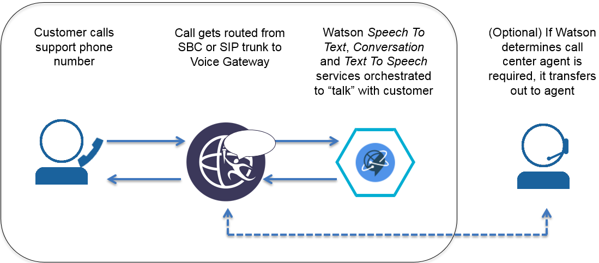
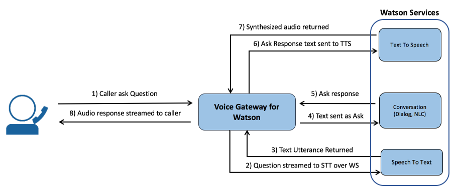
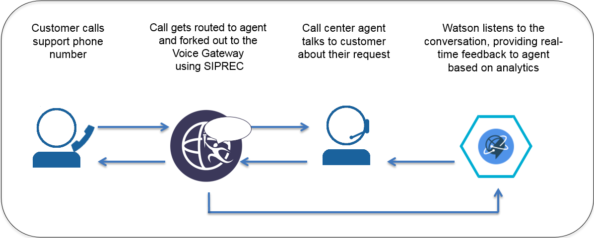
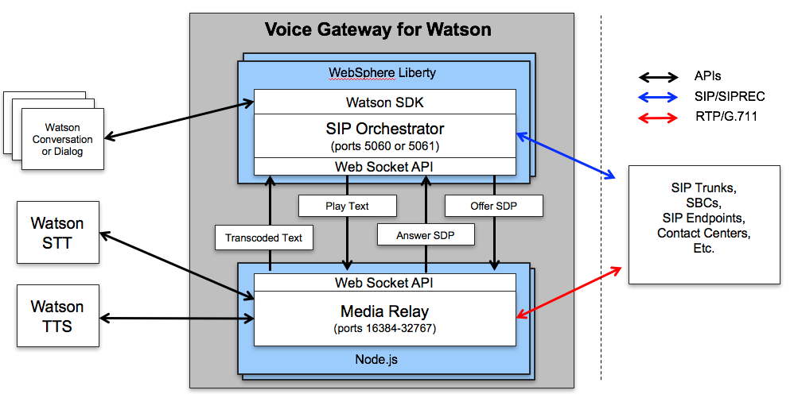
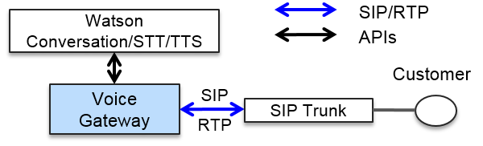
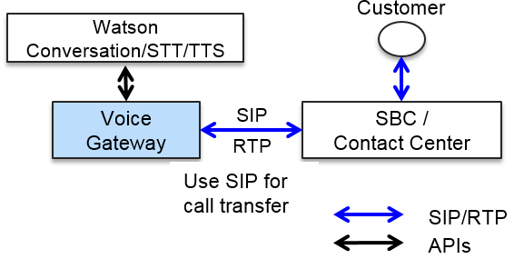
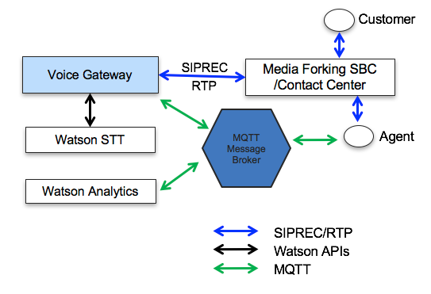

# About Voice Gateway for Watson

IBM&reg; WebSphere&reg; Connect Voice Gateway for Watson&trade; provides a Session Initiation Protocol (SIP) gateway into a set of orchestrated Watson services to automate or assist customer interactions.

 * [Ways to use Voice Gateway for Watson](#ways_to_use_voice_gateway_for_watson)
 * [Architectures for each use](#architecture)
 * [Supported protocols](#supported-protocols)

## Ways to use Voice Gateway for Watson

With Voice Gateway for Watson, you can set up both _self-service agents_ and _agent assistants_.

* _Self-service agents_ are similar to an Interactive Voice Response (IVR) system, which provides an automated way to communicate with callers using audio over a telephone call. With Watson, self-service agents communicate in a more conversational manner and can handle complex interactions that are difficult for traditional IVRs.

* _Agent assistants_ provide a way to run real-time analytics on a phone call between a caller and a live human agent by converting the voice streams into text. These text utterances can then be processed with services outside of the voice gateway such as the Watson Natural Language Classification service and the Watson Rank and Retrieve service to generate useful information that an agent can immediately use to help a caller. Note that integration with specific analytic services will not be covered here.

The type of implementation that you choose determines how you set up Voice Gateway for Watson.

### Self-service agents

With self-service agents, customers are directed through the gateway to interact with Watson services that you train to provide certain responses. You can optionally enable the Watson services to opt-out to a call center agent by initiating a call transfer through the API defined in this document.

##### Conversation flow with a self-service agent

This diagram shows how the voice gateway orchestrates the various Watson services to enable a self-service agent. As you can see, there is a flow of utterances between the services that result in a conversation with the caller:

##### Features and capabilities for self-service agents

* **Barge-in:** Callers can interrupt Watson if the utterance Watson is sending to the caller is inappropriate for the context of the conversation.
* **Watson Conversation service orchestration:** Support for the Watson Conversation service is included in the gateway.
* **Call transfer:** The gateway can be signaled to initiate a transfer from the Watson Conversation service through the use of state variables. To perform the transfer, the gateway uses a SIP REFER as defined in section 6.1 of [RFC 5589](https://tools.ietf.org/html/rfc5589).
* **Call hang-up:** The gateway can be signaled to terminate a call from the Watson Conversation service through the use of a state variable.
* **Music on hold:** The gateway can play an audio file that is specified by the Conversation for some period of time or until processing in the Conversation completes.
* **SSML tagging:** Speech Synthesis Markup Language (SSML) tags are used to control how Text to Speech synthesizes utterances into audio. The gateway supports passing these tags through to Text to Speech when received from the Conversation.
* **Latency auditing:** The gateway monitors latency, which is a key indicator on how well Watson is communicating with a caller. Because the gateway orchestrates several Watson services, it's critical to be able to identify when one of these services is slow to respond, which ultimately results in long voice response delays and unnatural conversations with the caller.
* **Context mapping:** When transferring out of Watson, the gateway provides a way for the Conversation to specify metadata that gets embedded in the SIP REFER message. The metadata can be used to map context saved during the Watson conversation back to a live agent session.
* **Audio recording:** The gateway can be configured to record audio conversations in the form of 16-bit, stereo WAV files. These WAV files are stored on a configured volume and must be retrieved through some external means such as ftp. Typically this feature is used to gather training data for the Speech to Text service.
* **DTMF support:** The gateway supports [RFC 4733](https://tools.ietf.org/html/rfc4733), RTP Payload for DTMF Digits, Telephony Tones, and Telephony Signals. Dual-tone multifrequency (DTMF) signals are converted into single digit text utterances that are sent to the configured Watson API.
* **Whitelisting:** To prevent Denial of Service attacks, the gateway supports the ability to configure a whitelist. This whitelist enables filtering of inbound SIP INVITE requests based on the SIP to URI and from URI.

### Agent assistants

The voice gateway provides the ability to transcribe caller and callee (e.g. contact-center agent) audio from an active phone call in real-time using the SIPREC protocol. This capability requires a Session Border Controller (SBC) that supports the ability to fork media out to the voice gateway, which is acting as a SIPREC Session Recording Server (SRS).

### Real-Time Voice Transcription

Voice Gateway for Watson provides a plug-in that can be used to publish MQTT events on topics that reflect the caller and callee of a particular phone call whenever a text utterance is transcoded. This capability enables real-time recording of call transcriptions or analytic processing of the speech to provide real-time feedback to a live contact center agent.

## Architecture

The Voice Gateway for Watson is one of several components in the overall architecture of self-service agents and agent assistants. The architecture and technologies used differ depending on your implementation. For self-service agents, callers can either connect directly to the voice gateway via a SIP trunk or indirectly through a session border controller (SBC).

#### Voice Gateway architecture
Voice Gateway for Watson is composed of two separate microservices, the _SIP Orchestrator_ and the _Media Relay_. These microservices are delivered in the form of two separate Docker images.

* **SIP Orchestrator:** Orchestrates Watson Conversation service and the Media Relay
   * Runs on WebSphere Application Server Liberty.
   * Acts as either a SIP User Agent Server (UAS) or a SIPREC Session Recording Server (SRS)
   * Built in Java
   * Delivered as a WebSphere Liberty User Feature
   * Configured via Docker environment variables
* **Media Relay:** Handles all media processing for the voice gateway
   * Runs on Node.js
   * Processes inbound and outbound RTP audio
   * Orchestrates Watson Speech to Text (STT) and Text to Speech (TTS) services
   * Built in JavaScript using Node Streams architecture
   * Delivered as a Node Module
   * Configuration via Docker environment variables

The following diagram shows at a high-level how these two microservices combine to provide the full functionality of the Voice Gateway for Watson:

#### Self-service agent architecture when using a SIP trunk

When connecting to a self-service agent through a SIP trunk, you will need to configure you SIP trunk to forward INVITE requests to the voice gateway based on its IP address and SIP port:

**??? When would you use a SIP trunk over an SBC?**

#### Self-service agent architecture when using an SBC

In a self-service agent where communications flow through a session border controller (SBC), you will need to configure the SBC to forward calls to the voice gateway based on its IP address and SIP port. Note that the SBC must stay in the call path to handle SIP REFER messages if an opt-out transfer is required:

**??? When would you use an SBC over a SIP trunk? Seems to differ based on if you want to forward to a human call center agent?**

#### Agent assistant architecture

For agent assistants, media for calls is forked out to the voice gateway via the SIPREC protocol. This diagram also shows how transcriptions from the voice gateway can be accessed via an MQTT message broker:

## Supported protocols

* **SIP/SIPS**: The gateway supports connecting to Watson as if it were a SIP endpoint via a SIP trunk or from an enterprise session border controller (SBC). Use this method to connect to Watson when the voice gateway is deployed as a self-service agent.
* **SIPREC**: Session border controllers can fork media from a phone call between a customer and agent to Watson through the voice gateway using SIPREC to convert the voice streams to text for analytic processing.
* **RTP**: The Real-time Transport Protocol (RTP) is supported for audio media streams.
* **G.711:** The voice gateway supports only G.711 audio. Other audio protocols, such as G.723 or G.729, are not currently supported.
* **MQTT:** MQ Telemetry Transport (MQTT) is supported for publishing speech utterances for transcription.
