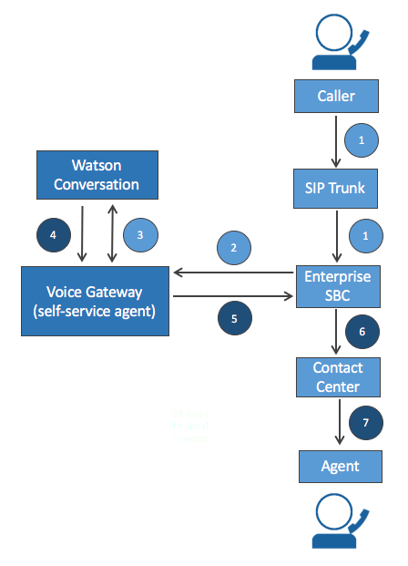

# Integrating the voice gateway with a contact center for self-service agents

When using the voice gateway to host a self-service agent, in some cases a customer might want to be transferred to a live contact center agent. The voice gateway can integrate with existing contact centers through an enterprise session border controller (SBC). The SBC handles the following call routing scenarios:

* Inbound calls to the voice gateway from a caller connecting through a SIP trunk
* Calls redirected to the voice gateway from an enterprise Interactive Voice Response (IVR) system
* Calls redirected from the voice gateway to a contact center or IVR system

The voice gateway relies on standard SIP transfer procedures to redirect a call to a contact center using an in-dialog SIP REFER message.

**Important!** The call path must include some entity that acts as a pivot-point for the call to catch the SIP REFER and handle the redirect. This pivot point is typically the session border controller, which interfaces with an external SIP trunk and forwards calls to the voice gateway. Enterprise SBCs can typically handle SIP REFER messages received over an existing SIP dialog and use that message to redirect an existing call to the contact center in the enterprise network.

<h5> Call flow through SBC with transfer to contact center</h5>
 

This diagram shows the typical flow of messages related to both setting up a new call through an enterprise SBC with a transfer out to a contact center:

1. The call arrives at the SBC through SIP trunk.
1. The call is routed to the voice gateway, and the SBC stays in the call-signaling path.
1. A new Watson conversation is established, and the caller initiates turns with the Conversation through voice.
1. Watson Conversation initiates a transfer on last turn based on caller input.
1. The voice gateway initiates a transfer back to the SBC by sending an in-dialog SIP REFER message.
1. The SBC re-routes call to the contact center automatic call distributor (ACD).
1. The call is eventually routed to the agent.

Initiation of the call transfer is completely controlled by the Conversation through the following state variables:

| state var name | value | description | default |
| -------------- | ------ | ----------- | ---------- |
| cgwTransfer | Yes | Informs the CGW to initiate a transfer after the included text response is played back to the caller| - |
| cgwTransferTarget | sip or tel URI | Identifies the transfer to endpoint (e.g. tel:+18883334444) | - |

The voice gateway can also be configured to automatically transfer to a static endpoint if a failure occurs. This can happen for instance if the voice gateway loses connectivity to one of the configured Watson services. First, this state variables can be set on the first turn of the conversation and will be used if there is a failure of some kind at any point during the call:

| state var name | value | description | default |
| -------------- | ------ | ----------- | ---------- |
| cgwTransferFailedMessage | text string | Message streamed to the caller if the call transfer fails. Should be set by the Conversation on the first turn. | - |
| cgwConversationFailedMessage | text string | Message streamed to the caller if the Conversation service fails. Should be set by the Conversation on the first turn. | - |

If for some reason, the Watson Conversation service can not be reached, the follow configuration environment variables can be used to force a transfer to a static phone number:

| env var | default              | details |
| -------------- | -------------------- | --------------------------------------------------------------- |
| CONVERSATION_FAILED_REPLY_MESSAGE | Call being transferred to an agent due to a technical problem. Good bye. | Message streamed to the caller if the Conversation service fails |
| TRANSFER_DEFAULT_TARGET | none | Identifies the target transfer to endpoint. Must be valid SIP or tel URI (e.g. sip:10.10.10.10). This is a default transfer target. Used only when a failure occurs and the call transfer target can't be obtained from the Conversation API |
| TRANSFER_FAILED_REPLY_MESSAGE | Call transfer to an agent failed. Please try again later. Good bye. | Message streamed to the caller if the call transfer fails |

Typically, a SIP call coming into an enterprise SBC will have a globally unique ID (GUID) added to the SIP signalling as a custom header which is used to track a call throughout its lifetime within the enterprise network. The voice gateway can be configured to extract the GUID from the initial SIP invite and pass the same GUID as a header in a subsequent REFER message to insure a call can be properly tracked as it propagates to a contact center agent.

This configuration item identifies the custom header that will be pulled out of the initial SIP INVITE message that establishes the call:

| env var | default              | details |
| -------------- | -------------------- | --------------------------------------------------------------- |
| CUSTOM_SIP_INVITE_HEADER | n/a | When set, the specified SIP header will be passed to the Conversation in this state variable: cgwSIPCustomInviteHeader |

And these state variables can be used by the Watson Conversation to inform the voice gateway of the custom header to set in the outgoing REFER message:

| state var name | value | description | default |
| -------------- | ------ | ----------- | ---------- |
| cgwTransferHeader | user defined | Defines a custom header in an outgoing SIP REFER message during a transfer. The custom header value is defined by the cgwSIPTransferHeaderVal state variables | - |
| cgwTransferHeaderVal | user defined | Defines the value of a custom header in an outgoing SIP REFER message during a transfer. The custom header is defined by the cgwTransferHeader state variables | - |
